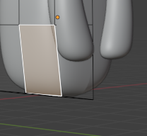

## Descrizione dei Passaggi effettuati (`Stitch6.blend` - Zampe Inferiori)
Per poter creare le zampe, è stato necessario usare un Loop Cut sul busto (Edit Mode `Tab` > `Ctrl + R`), selezionare la faccia che è stata creata ed estruderla verso l'esterno (`E` in Edit Mode) diverse volte usando di volta in volta il comando che permette di ruotare oggetti (`R`)

Successivamente bisogna specchiare la zampa appena creata e per poterlo fare è fondamentale 

