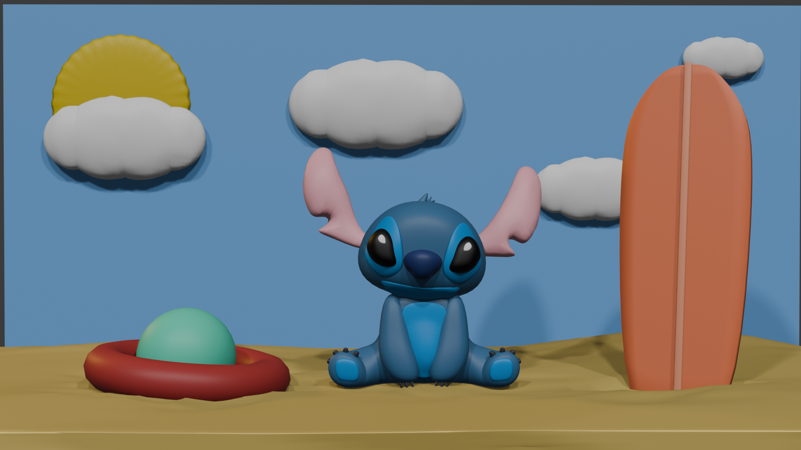

# Descrizione dei passaggi effettuati (`Stich9.blend` - Creazione scena)
## Descrizione dei passaggi effettuati
Cose fatte nell'ultima tappa:
1. Sabbia: 
    * oggetto di partenza: cube
    * creare diversi loop cut, in altezza e in larghezza
    * per creare l'effetto di sabbia sollevata, si prendono diversi vertici a caso e si sollevano con `G > Z` verso l'alto
    * per generarli a caso in tutta la Mesh, si va su `Object > Transform > Randomize Transform`, ottenendo così diverse "dune" di sabbia su quasi tutto l'oggetto
1. Nuvole: 
    * prendere 4 `UV sphere` e metterli accanto, le due sfere centrali vanno ingrandite
    * per togliere le linee che vanno a crearsi andando a sovrappore le sfere, in `Object Mode` scegliere gli oggetti e unirli in un'unica Mesh (`Ctrl + J`)
    * in `Sculpt Mode`
2. Tavola da surf: 
    * inserito un piano (`Shift + A > Mesh > Plane`)
    * allungato e ristretto 
    * applicato modifier Solidify (`Add modifier > Generate > Solidify`)
    * ruotato verso la `Camera` (`R`)
    * inserito dentro quella che dovrebbe essere sabbia con `G > Z` ;
3. Palla (`Shift + A > Mesh > UV Sphere`), inserita dentro la ciambella;
4. Ciambella (`Shift + A > Mesh > Torus`)
5. Sole: cilindro (`Shift + A > Mesh > Cilidro`) a cui è stato applicato Subdivision Surface e, infine, Shade Smooth (`Click destro > Shade Smooth`)

## Risulato finale della tappa

