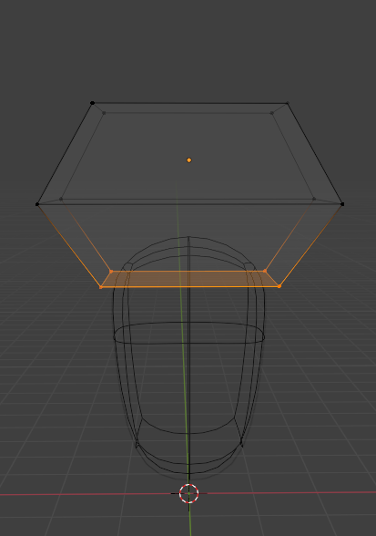
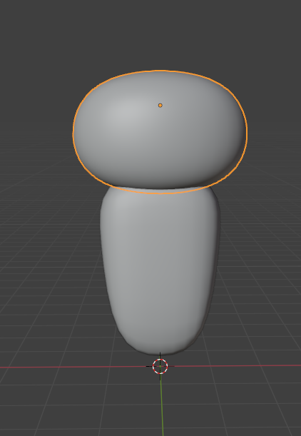

## Descrizione dei Passaggi effettuati (`Stitch2.blend` - Testa)
Per la creazione della testa, i passaggi sono simili a quelli effettuati per il busto, ovvero:
- prendere il Cube (`Shift + A, Mesh > Cube` );
- posizionarlo sopra il busto (`G + Z`)
- aggiungere un loop cut al centro(passare in `Edit Mode` con `Tab` e poi `Ctrl + R`)
- deformarlo e farlo assomigliare ad un esagono, prendendo i vertici superiori ed inferiori della figura con `S + X` per stringerli e la linea centrale, sempre con `S + X` per allungarlo 

    

- aggiungere il Modifier Subdivision Surface (`Add Modifier > Generate > Subdivision Surface`)
- aggiungere Shade Smooth (tasto destro sull'oggetto > `Shade Smooth`)

    