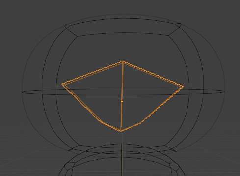

## Descrizione dei Passaggi effettuati (`Stitch3.blend` - Muso)
Per la creazione del muso, i passaggi sono simili a quelli effettuati per il busto e la testa, ovvero:
- prendere il Cube (`Shift + A, Mesh > Cube` );
- posizionarlo dentro la testa, al suo centro(`G + Z`), spostarlo appena fuori da essa in modo che sia visibile (`G > X`) e ruotarlo di pochi gradi verso l'alto (`R`)
- aggiungere un loop cut al centro (passare in `Edit Mode` con `Tab` e poi `Ctrl + R`)
- deformarlo e farlo assomigliare ad un esagono molto irregolare, prendendo i vertici superiori ed inferiori della figura con `S > X` per stringerli e la linea centrale, sempre con `S > X` per allungarlo

    - 

- aggiungere il Modifier Subdivision Surface (`Add Modifier > Generate > Subdivision Surface`)
- aggiungere Shade Smooth (tasto destro sull'oggetto > `Shade Smooth`)