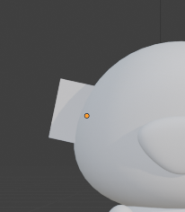
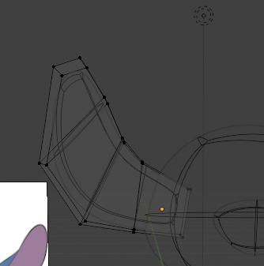
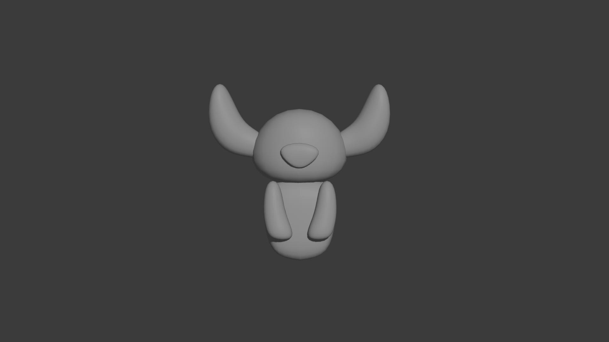

## Descrizione dei Passaggi effettuati (`Stitch5.blend` - Orecchie)
La struttura delle orecchie si basa su quasi tutto ciò che è stato usato per la creazione delle braccia, quindi:
- prendere il Cube (`Shift + A, Mesh > Cube` ), che sarà la base per la cotruzione dell'orecchio
      
- spostarlo verso l'esterno della testa (`G`) appena fuori da essa in modo che sia appena visibile e ruotarlo di pochi gradi verso l'alto (`R`)
- in Edit Mode, con il `3` andiamo a scegliere solo la faccia che si espone e con `E` estrudiamo quella faccia, ruotando (`R`) poco verso l'alto. Facciamo la stessa per tre volte.

    

- aggiungere il Modifier Subdivision Surface (`Add Modifier > Generate > Subdivision Surface`)
- aggiungere Shade Smooth (tasto destro sull'oggetto > `Shade Smooth`)
- infine, aggiungere il Modifier Mirror (`Add Modifier > Generate > Mirror`) per ottenere due orecchie uguali scegliendo come oggetto di riferimento il capo

## Risultato finale

