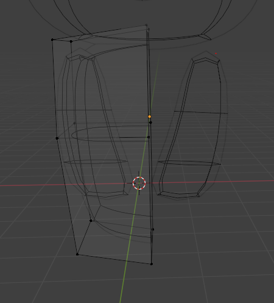
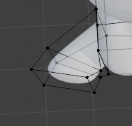
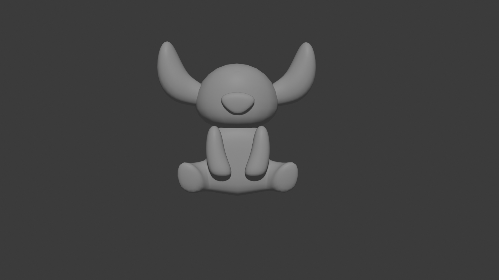

## Descrizione dei Passaggi effettuati (`Stitch7.blend` - Zampe posteriori)
Prima di procedere con la costruzione delle zampe, è necessario specchiare l'intero busto prima di cominciare. In Edit Mode, selezionare in alto a destra Viewport Shading, selezionare i vertici della parte destra del busto ed eliminarli (`X` > `Vertices`) avendo così come risultato intermedio:

Dopo è stato necessario applicare il modifier Mirror (`Add Modifier > Generate > Mirror`) così ottenendo un busto uniforme da tutti e due i lati.

Per poter creare le zampe, è stato necessario usare un Loop Cut sul busto (Edit Mode `Tab` > `Ctrl + R`), selezionare la faccia che è stata creata ed estruderla verso l'esterno (`E` in Edit Mode) diverse volte usando di volta in volta il comando che permette di ruotare oggetti (`R`)

# Risultato finale
