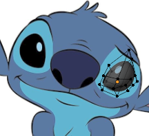
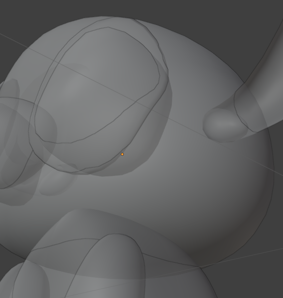
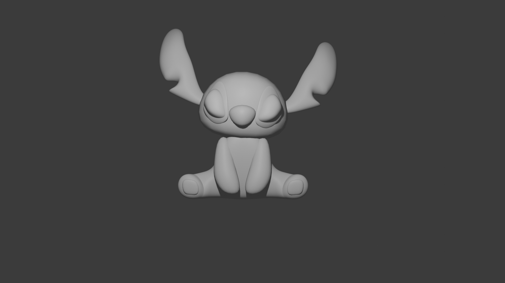

# Descrizione dei passaggi effettuati (`Stich7.blend` - Occhi)
Per la costruzione degli occhi, si usano gli stessi passaggi effettuati per gli arti creati in precedenza.

Inizialmente, bisogna selezionare un oggetto Cube; in Edit Mode aggiungere dei Loop cut (`Ctrl+R`) ed infine applicare il modifier `Subdivision Surface`. Per creare un occhio simile a quello di Stitch a questo punto, o lo si fa a "sentimento" oppure si sovrappone la pallina creata, all'immagine di riferimento e si cerca, tramite la manipolazione dei vertici, di farla combaciare all'occhio del personaggio rappresentato in figura (`Shift + A > Image > Reference`).

Successivamente, lo si sposta vicino al muso in maniera che risulti essere visibile (lo si incastona dentro la testa, in sostanza) e poi si applica il modifier `Mirror` (sull'asse delle x) con oggetto di riferimento il capo, ottenendo così due occhi.

Per generare, invece, la parte che si vede sotto l'occhio, si duplica l'oggetto (`Ctrl + D` in `Object Mode`), si rende meno spesso con `S + Y` e poi lo si sposta vertice dopo vertice (in coppia) sotto l'occhio finendo per assomigliare all'immagine scelta.

Le imperfezioni che si notano, ovvero il fatto che si veda che la parte sotto non ricopra interamente fino a ricoprire del tutto l'occhio, verranno poi risolte.

# Risulato finale della tappa

