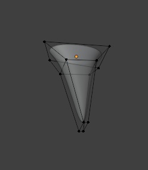
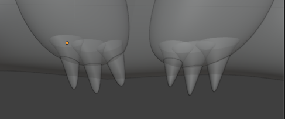
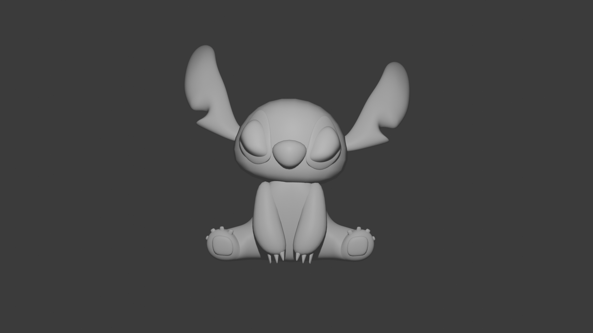

# Descrizione dei passaggi effettuati (`Stich8.blend` - Unghie alle zampe inferiori e mani)

Le unghie sono state la parte meno complicata da fare a questo punto, in quanto, come tutti gli altri oggetti, sono stati utilizzati i modifier Mirror e Subdivision Surface.
Come fatto con gli oggetti creati in precedenza:
* si prende un cubo
* si allunga (`S + Z`)
* si creano due Loop Cut, uno verso la parte inferiore e un altro verso la parte superiore del cubo
* si applica il `Subdivision Surface`
* si applica anche `Shade Smooth`

E così facendo abbiamo creato un'unghia inseribile all'interno del braccio sinistro.

Si creano altre due unghie, usando `Ctrl + D`,che inseriamo anche queste nel braccio sinistro.
Successivamente applichiamo il modifier `Mirror` per poterle inserire anche nel braccio destro.

## Risulato finale della tappa

