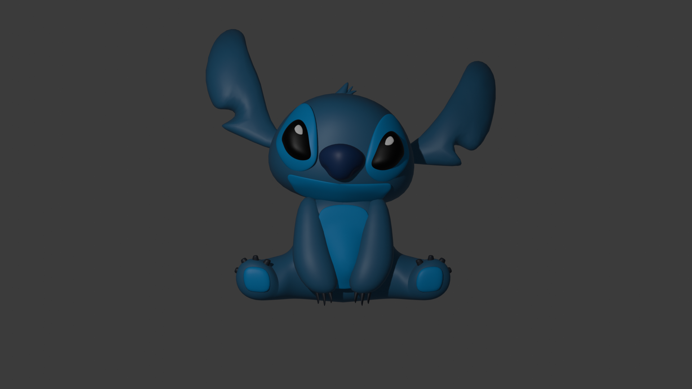

# Descrizione dei passaggi effettuati (`Stich9.blend` - Ultmi dettagli e Colorazione personaggio)

In questa tappa si creano gli ultimi dettagli per poi concludere con la creazione della scena, ovvero:
- bocca: lo stesso procedimento che è stato adottato per la creazione della parte sottostante all'occhio va applicato per costruire la bocca
- ultimi dettagli negli occhi: aggiungere oggetti con `Ctrl + D`(rispetto all'occhio) per simulare riflessi di luce
- deformazione nel naso, per far sembrare che abbia le "narici": 
    - applicare tutti i modifier del naso
    - passare in Sculpt Mode e cercare `Grab Silhouette`
    - selezionare in alto destra affinchè le operazioni effettuate con Grab vengano rispettate sull'asse delle X (sia a destra che a sinistra dell'oggetto selezionato) 
    - prendere le estremità del muso e spostarla verso il centro del muso
- deformazione della pancia:
    - applicare tutti i modifier presenti nel busto,
    - passare in Sculpt Mode e cercare `Grab`
    - selezionare in alto destra affinchè le operazioni effettuate con Grab vengano rispettate sull'asse delle X (sia a destra che a sinistra dell'oggetto selezionato)
    - prendere la pancia e spostarla verso l'esterno

- dare colore al personaggio: 
    - colori scelti per ciasuna parte del corpo:
        - ` #00000000`: occhi
        - ` #273C75FF`: muso
        - ` #0097E6FF`: parte sottostante agli occhi, bocca, zampe, pancia
        - ` #353B48FF`: unghie
        - ` #40739EFF`: le altri parti del corpo
    - spostarsi nel pannello in basso a destra, selezionando l'oggetto che si vuole colorare e scegliendo il colore in `Material > Surface`

## Risulato finale della tappa

